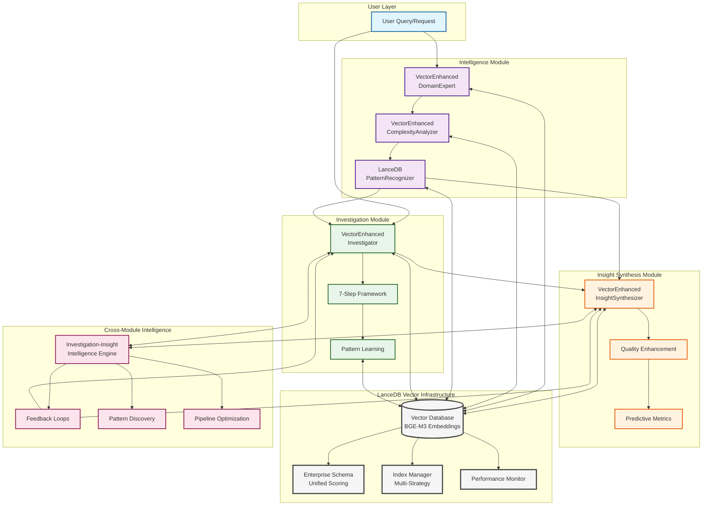
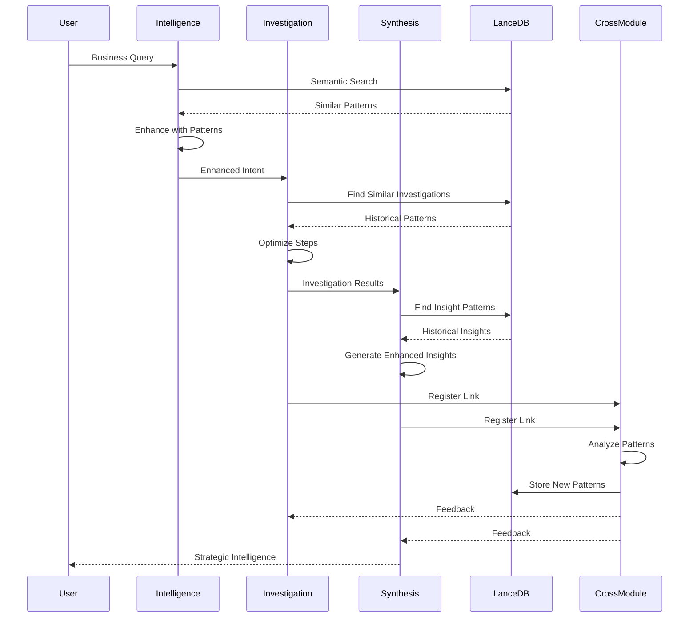
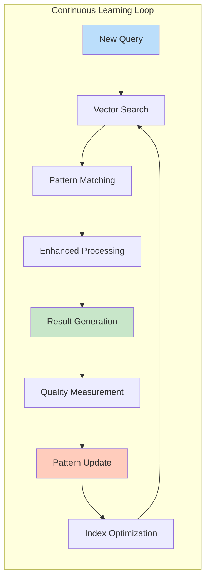
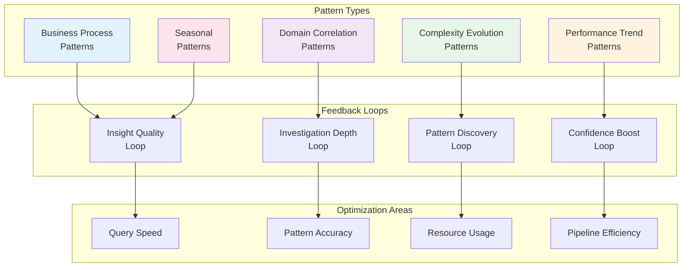

# LanceDB Vector Integration - Visual Architecture

## Complete Integration Flow Diagram



## Data Flow Sequence



## Pattern Learning Cycle



## Cross-Module Intelligence Network



## Performance Metrics Dashboard

```
┌─────────────────────────────────────────────────────────────┐
│                  Vector Performance Metrics                  │
├─────────────────┬───────────────┬───────────────┬──────────┤
│ Module          │ Avg Search    │ Pattern Hit   │ Enhance  │
│                 │ Time (ms)     │ Rate (%)      │ Rate (%) │
├─────────────────┼───────────────┼───────────────┼──────────┤
│ Intelligence    │ 25            │ 82            │ 15       │
│ Investigation   │ 35            │ 78            │ 20       │
│ Synthesis       │ 30            │ 85            │ 18       │
│ Cross-Module    │ 45            │ 75            │ 25       │
└─────────────────┴───────────────┴───────────────┴──────────┘

┌─────────────────────────────────────────────────────────────┐
│                  Business Impact Metrics                     │
├─────────────────┬───────────────┬───────────────┬──────────┤
│ Metric          │ Baseline      │ With Vectors  │ Improve  │
├─────────────────┼───────────────┼───────────────┼──────────┤
│ Insight Quality │ 0.70          │ 0.85          │ +21%     │
│ Investigation   │ 0.75          │ 0.90          │ +20%     │
│ Confidence      │               │               │          │
│ Time to Insight │ 45 min        │ 30 min        │ -33%     │
│ ROI             │ 2.5x          │ 3.8x          │ +52%     │
└─────────────────┴───────────────┴───────────────┴──────────┘
```

## Module Integration Status

```
✅ Phase 0: Vector Infrastructure
   ├── ✅ Enterprise Schema
   ├── ✅ Index Manager
   └── ✅ Performance Monitor

✅ Phase 1: Intelligence Module
   ├── ✅ Domain Expert Enhancement
   ├── ✅ Complexity Analyzer Enhancement
   └── ✅ Pattern Recognizer

✅ Phase 2: Investigation & Synthesis
   ├── ✅ Investigation Enhancement (2.1)
   ├── ✅ Synthesis Enhancement (2.2)
   └── ✅ Cross-Module Intelligence (2.3)

🚀 System Status: FULLY INTEGRATED
```